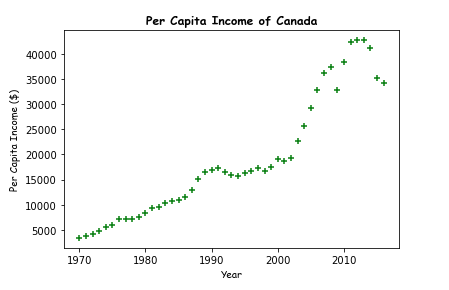

# Data Analytics Assignment
Solution to data analytics assignment during IITB Workshop Techfest 2020

****

**Topic: Linear Regression with sklearn**

**Aim: To predict the per capita income of Canada base on past data**

****

### Source Files:
 - `predicted_pci.csv` holder the predictions along with their corresponding years
 - `years.csv` The year for which we want to predict the per capita income
 - `canada_per_capita_income.csv` The file with the current per capita income data
 - `Solution.ipynb` The jupyter notebook with the solution/code
 - `scatterplot.png` Picture of the scatterplot of the current per capita income Data.

### Scatterplot
</img>

### License
[MIT License](https://github.com/krishaayjois21/tf2020-data-analytics-exercise/blob/main/LICENSE)

